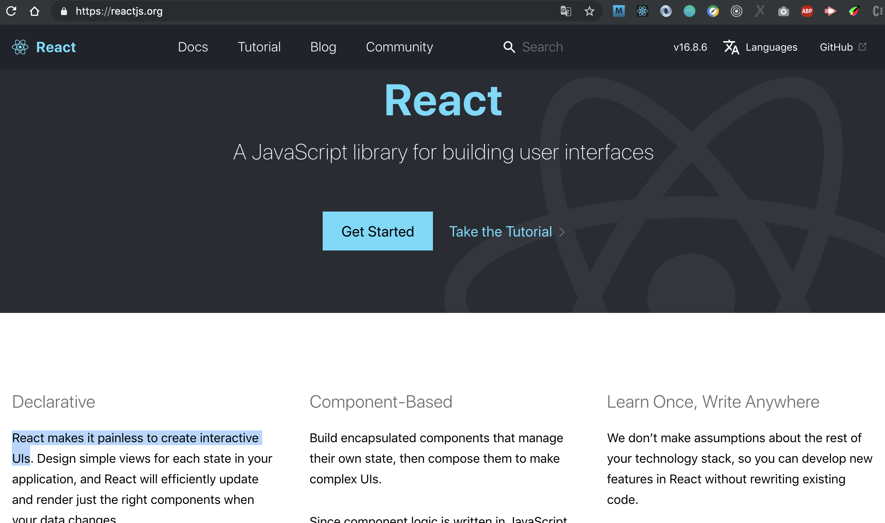

# Sharing Session :smile:


# Dependencies
- React
- React Dom
- Redux
- React-Redux
- Axios
- React-router-dom

# Materi
- React Dasar
- State Management

# React JS
React itu library yang membantu kita mengurangi rasa **SAKIT**, sakit apa?
kita cek apa kata team react

> ## React makes it painless to create interactive UIs



- State
- Props

## Redux


## Reference
- https://reactjs.org/
- https://redux.js.org/
- https://www.fullstackreact.com/


# Wine App


https://wines-api.herokuapp.com/

### Store 
> src/store.js
```javascript
import { createStore, combineReducers, applyMiddleware } from 'redux'
import NewsReducer from './news.reducer'
import thunk from 'redux-thunk';

const combine = combineReducers({
    news:NewsReducer,
})

const Store = createStore(combine,applyMiddleware(thunk))

export default Store
```

## Reducer
> src/store/newsReducer.js
```javascript
import { GET_NEWS_REQUEST, GET_NEWS_ERROR, GET_NEWS_DONE } from './news.type'
const initialState = {
  news: [],
  isLoaded: false
}

export default (state = initialState, action) => {
  switch (action.type) {
    case GET_NEWS_REQUEST:
      return {
        ...state,
        isLoaded: true
      }
    case GET_NEWS_DONE:
      return {
        ...state,
        news: action.payload.news,
        isLoaded: false
      }
    case GET_NEWS_ERROR:
      return {
        ...state
      }
    default:
      return state
  }
}
```

## Type
> news.type.js

```javascript
export const GET_NEWS_REQUEST = 'GET_NEWS_REQUEST'
export const GET_NEWS_DONE = 'GET_NEWS_DONE'
export const GET_NEWS_ERROR = 'GET_NEWS_ERROR'
```

## Action 
> news.action.js
```javascript
import axios from 'axios'
import {
  GET_NEWS_REQUEST,
  GET_NEWS_DONE,
  GET_NEWS_ERROR
} from './news.type'

export const getNews = (keyword) => {
  return dispatch => {
    dispatch({
      type: GET_NEWS_REQUEST
    })
    axios({
      method: 'GET',
      url: URL_News + `everything?q=${keyword}&from=2019-02-07&sortBy=publishedAt&apiKey=${key}`
    })
      .then((response) => {
        dispatch({
          type: GET_NEWS_DONE,
          payload: {
            news: response.data.articles
          }
        })
      })
      .catch(err => {
        dispatch({
          type: GET_NEWS_ERROR
        })
      })
  }
}
```

## Provider
> index.js
```javascript
import React from 'react';
import ReactDOM from 'react-dom';
import App from './App';
import * as serviceWorker from './serviceWorker';
import {Provider} from 'react-redux';
import Store from './Store';


ReactDOM.render(
    <Provider store= {Store} ><App /> </Provider>
    , document.getElementById('root'));

serviceWorker.unregister();
```

## Connecting

> components/example.js
```javascript
import React, { Component } from 'react';
import {connect} from 'react-redux'
import {getNews} from '../Store/news.action'

class Home extends Component {
  componentDidMount(){
    this.props.WeatherAction()
    this.props.NewsAction('Indonesia')
  }
  render() {
    return (
      <div>Content ...</div>
    );
  }
}

const mapStateToProps = (Store) => {
    return {
        news: Store.news
    }
}

const mapDispatchToProps = dispatch => {
  return {
    NewsAction: (data) => {
      dispatch(getNews(data))
    }
  }
}

export default connect(mapStateToProps, mapDispatchToProps)(Home);
```


- Ambil seluruh data Region: 
  - url: https://wines-api.herokuapp.com/api/regions
  - method: GET

- Ambil Wine Berdasarkan Region
  - url: https://wines-api.herokuapp.com/api/wines?region=:region
  - method: GET

- Ambil Gambar wine sesuai id
  - url: https://wines-api.herokuapp.com/api/wines/:id/image
  - method: post

----

Thanks

Asrul H :smile:
